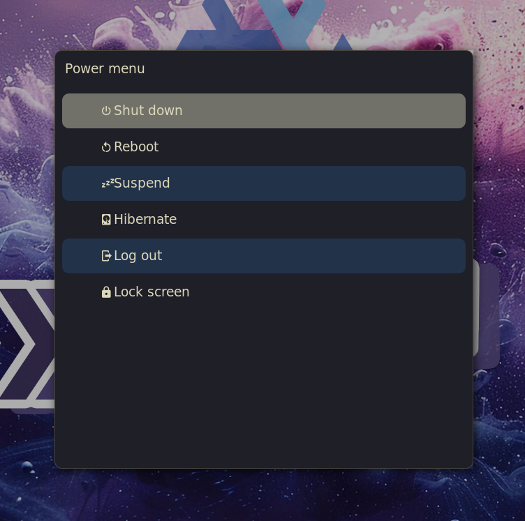

# 🌊 Kanagawa Paper Rofi theme

A simple theme for **[rofi](https://github.com/davatorium/rofi)** based on **[kanagawa-paper.nvim](https://github.com/sho-87/kanagawa-paper.nvim)** by [@sho-87](https://github.com/sho-87).



## 📦 Setup

1. Copy <a href="kanagawa-paper.rasi">kanagawa-paper.rasi</a> file to `~/.config/rofi/kanagawa-paper.rasi`
2. Add the following lines to your rofi config (`~/.config/rofi/config.rasi`):
```
configuration {
    display-ssh:    "";
    display-run:    "";
    display-drun:   "";
    display-window: "";
    display-combi:  "";
    show-icons:     true;
}

@theme "~/.config/rofi/kanagawa-paper.rasi"
```
